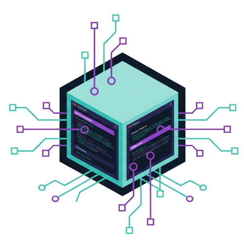
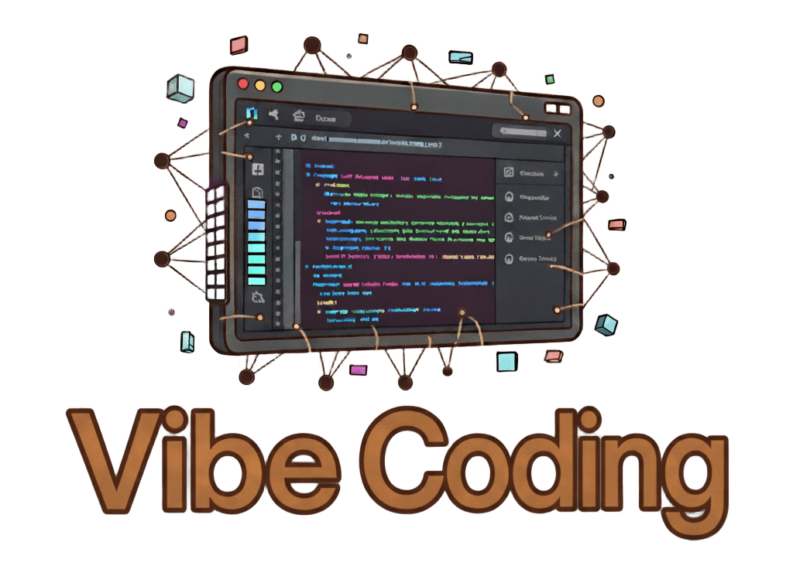

<div align="center">



# Task Runner GUI (taskg)

_Terminal task explorer with vibes._

</div>

Task Runner GUI (taskg) is a minimal **terminal UI** wrapper around the excellent **Task** project: https://taskfile.dev/
It discovers tasks (including those from includes/extends), lets you filter instantly, and then runs the selected task after the UI exits. Zero streaming pane, zero fluff.

<div align="center">


</div>

<div align="center">

**A VibeCode Project**



</div>

> ⚠️ **Notice**
> This is a **VibeCode** side project. Regular issue triage is not guaranteed. **Please open Issues only when accompanied by a Pull Request** (bug fix or improvement). I’m still learning and playing with GO; PR‑first keeps the project moving. All constructive contributions are welcome.


## Quick Features
* Auto Taskfile discovery (walks up directories)
* Tabs: prefix before first `-` → grouped tab; no dash → Main
* Instant incremental search (just type or press `/`)
* Clean two-line header + tab bar + scrollable task list
* Keyboard first; optional mouse
* Dark / light themes (`--theme=dark|light`)

## Requirements
You must have the [Task CLI](https://taskfile.dev/installation/) installed and available on your `PATH` (the binary is usually named `task`).
If `task` is missing, the UI can launch but will not discover tasks.

## Quick Start
Ensure `task` works first:
```bash
task --version
```

```bash
make build   # or: go build ./cmd/taskg
./taskg      # run inside any repo with a Taskfile
```

Optional:
```bash
./taskg --theme=light
./taskg --no-mouse
./taskg --project ../other/repo
```

## Key Shortcuts
| Key | Action |
|-----|--------|
| ↑ / k | Up |
| ↓ / j | Down |
| PgUp / PgDn | Fast scroll |
| Home / End | Jump list edges |
| ← / → / Tab / Shift+Tab | Switch tabs |
| / | Search mode |
| Esc | Clear / exit search |
| Enter | Run selected task & quit |
| q / Ctrl+C | Quit |

## Task Grouping
`db-migrate` and `db-seed` → tab `db`.  `build` (no dash) → `Main` tab.

## Contributing
PR‑first workflow:
1. Fork & branch (e.g. `feat/x`, `fix/y`).
2. Keep patches focused & small.
3. Run basic checks: `task fmt`, `task lint`, `task test` (or equivalents).
4. Open PR with a short rationale.

Good first ideas: additional themes, better status messages, lightweight tests for parsing, optional fuzzy search, CI config.

## Acknowledgements
Built on top of the amazing [Task](https://taskfile.dev/) and the Bubble Tea / Lip Gloss ecosystem.

## License
MIT. Not affiliated with the Task project; this is an independent wrapper UI.
